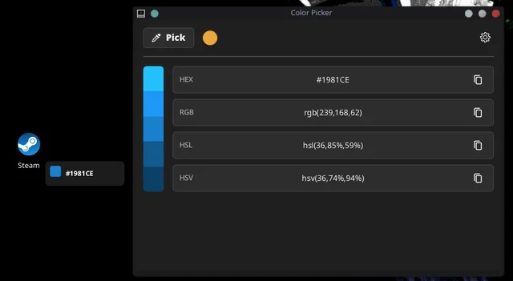

# Archtoys



> *A lightning-fast, system-wide color picker for Linux, inspired by the Microsoft PowerToys Color Picker.*

Built from the ground up to feel completely native on KDE Plasma, Archtoys provides a seamless workflow for designers and developers. It targets Arch-based and Fedora distributions natively, while offering universal support for other distros via AppImage.


## ✨ Features
*   **Custom Global Hotkeys:** Instantly summon the picker from anywhere (Default: `Ctrl+Super+C`). Note: Hotkeys must include at least one modifier (`Ctrl`, `Alt`, `Shift`, or `Super`).
*   **One-Click Capture:** Click any pixel on your screen to instantly select its color.
*   **Smart Clipboard:** Configure the app to automatically copy the color value to your clipboard or open the details panel immediately after picking.
*   **Color History:** Keeps a running log of your selected colors for quick recall. (Clearing the history will wipe older entries but retain your currently selected color).
*   **Quality of Life:** Dedicated Dark Mode toggle, "Minimize on Pick" behavior, and an Autostart toggle for silent background execution on boot.


## 🚀 Installation

### 🔴 Fedora (via COPR)
```bash
sudo dnf copr enable mujtaba1i/archtoys
sudo dnf install archtoys
```

#### Manual RPM Install:
If you prefer not to enable the COPR repository, you can download the standalone .rpm packages directly:

1. Go to the Releases page and download the .rpm asset for your Fedora version.

2. Install it locally:

```Bash
sudo dnf install ./archtoys-<version>.fc*.x86_64.rpm
```
### 🔵 Arch Linux (via AUR)
Precompiled Binary (Fastest):

```bash
paru -S archtoys-bin
```
Build from Source:

```Bash
paru -S archtoys
```

### 📦 Universal (AppImage)
Works on any Linux distribution.

1.  Download the latest `Archtoys-<version>-x86_64.AppImage` from the Releases page.

2. Make the file executable and run it:

```bash
chmod +x Archtoys-<version>-x86_64.AppImage
./Archtoys-<version>-x86_64.AppImage
```

### 🖥️ Platform Support & Troubleshooting
Archtoys operates slightly differently depending on your display server protocol:

#### X11 (Fully Supported)
Enjoy the full feature set, including a live per-pixel cursor preview overlay that tracks your mouse movements and a global picker API.

#### Wayland (Supported with Limitations)
Due to Wayland's strict security policies regarding screen capture, the picker relies on compositor/portal integrations. The live per-pixel hover preview overlay near the cursor is not available on Wayland sessions.


## License
Released under the MIT License.