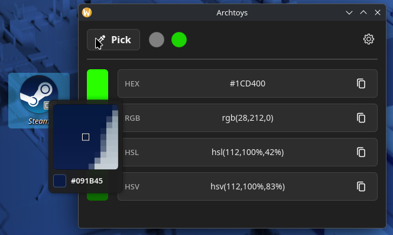
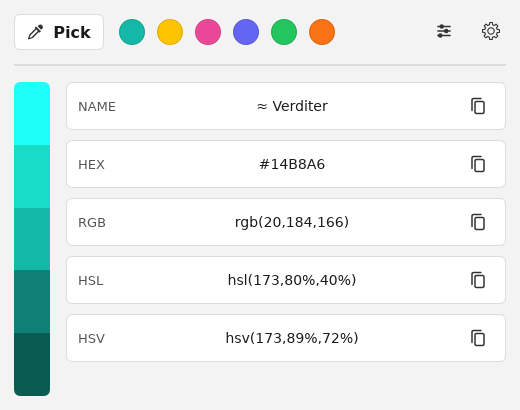
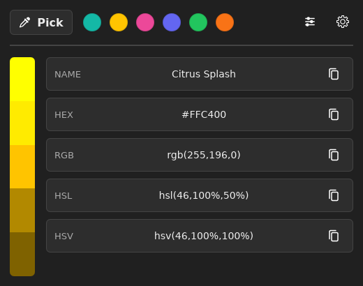

<div align="center">

# Archtoys

**A fast, system-wide color picker for Linux, inspired by Microsoft PowerToys.**

Pick any pixel on your screen, see it magnified, and copy it as HEX, RGB, HSL or HSV.<br>
Works on **Wayland and X11**, built to feel at home on **KDE Plasma**.

[](https://github.com/Mujtaba1i/Archtoys/releases/latest)
[](https://aur.archlinux.org/packages/archtoys-bin)
[](https://copr.fedorainfracloud.org/coprs/mujtaba1i/archtoys/)
[](https://github.com/Mujtaba1i/Archtoys/releases/latest)
[](LICENSE)



</div>

## Features

- **Pixel magnifier.** While picking, a card next to your cursor shows the surrounding pixels 10× larger, with the exact pixel you'll get outlined. No more guessing on high-resolution screens.
- **Live preview, on Wayland too.** The color updates as you move the mouse. On Wayland, Archtoys takes one screenshot and lets you pick from it ("freeze frame"), so you get the same preview and magnifier as on X11.
- **Four formats, always in sync.** HEX, RGB, HSL and HSV, each with a copy button. You can also *type* a color into any field, and the other three convert instantly.
- **Shades at a glance.** A bar of lighter and darker variations of your color. Click one to use it.
- **Color history.** Every color you pick is kept for quick access, even after a restart.
- **Global hotkey.** Start picking from anywhere (default `Ctrl+Super+C`). On Wayland it uses your desktop's own shortcut system.
- **Auto copy.** Optionally copy the color the moment you click, without opening the window.
- **Cancel anytime.** `Esc` or right-click cancels a pick and restores the previous color.
- **Stays out of your way.** System tray icon, run on startup, minimize on pick, light and dark themes.

<div align="center">

| Light | Dark |
|:---:|:---:|
|  |  |

</div>

## Installation

### Fedora (COPR)

```bash
sudo dnf copr enable mujtaba1i/archtoys
sudo dnf install archtoys
```

<details>
<summary>Prefer a standalone RPM?</summary>

Download the `.rpm` for your Fedora version from the [Releases page](https://github.com/Mujtaba1i/Archtoys/releases/latest), then:

```bash
sudo dnf install ./fedora-*-archtoys-*.rpm
```
</details>

### Arch Linux and derivatives (AUR)

```bash
paru -S archtoys-bin   # prebuilt binary (fastest)
paru -S archtoys       # build from source
```

`yay` works the same way.

### Any distribution (AppImage)

Download `Archtoys-<version>-x86_64.AppImage` from the [Releases page](https://github.com/Mujtaba1i/Archtoys/releases/latest), then:

```bash
chmod +x Archtoys-*-x86_64.AppImage
./Archtoys-*-x86_64.AppImage
```

The AppImage runs on any distribution from Ubuntu 22.04 onwards, or anything equally recent.

## Usage

| Action | How |
|---|---|
| Start picking | Click **Pick**, or press the hotkey (`Ctrl+Super+C`) |
| Pick the color | Left-click |
| Cancel | `Esc` or right-click (the previous color comes back) |
| Copy a value | Click the copy icon next to HEX, RGB, HSL or HSV |
| Enter a color by hand | Type into any field and press `Enter` |
| Use a lighter/darker shade | Click it in the shade bar |
| Reuse an old color | Click it in the history row |
| Change the hotkey, theme, startup… | The ⚙ settings button (on Wayland, the hotkey opens your desktop's shortcut settings) |

## Desktop support

| | KDE Plasma (Wayland) | GNOME (Wayland) | X11 (any desktop) |
|---|:---:|:---:|:---:|
| Picker with live preview and magnifier | ✅ freeze frame | ✅ freeze frame | ✅ live |
| Global hotkey | ✅ | ✅ GNOME 48+ · ⚠️ older: limited | ✅ |
| Tray icon | ✅ | ✅ with the AppIndicator extension¹ | ✅ |

¹ Ubuntu enables it by default. On other GNOME setups, install the *AppIndicator and KStatusNotifierItem Support* extension.

**How picking works on Wayland:** Wayland doesn't let apps watch the screen, which is good for your privacy. So when you start picking, Archtoys asks your desktop for **one screenshot** and shows it fullscreen while you choose. That's why moving content like videos pauses during a pick. The screenshot is deleted from disk as soon as it has been loaded, and nothing is ever saved.

## Troubleshooting

<details>
<summary><b>My desktop asks for permission the first time</b></summary>

That's expected on Wayland. Archtoys asks your desktop for permission to take a screenshot (for picking) and to register a shortcut (for the hotkey). Allow both once.
</details>

<details>
<summary><b>The hotkey doesn't work on Wayland</b></summary>

On Wayland, the hotkey belongs to your desktop's shortcut system (the GlobalShortcuts portal): the first time, your desktop asks you to confirm it. After that, Archtoys' settings show the shortcut your desktop actually uses, with a **Change in System Settings** button (on KDE: **System Settings → Keyboard → Shortcuts → Archtoys**). Older desktops without that portal use a fallback that only works while an X11 app has focus.

To force the fallback, start Archtoys with:
```bash
ARCHTOYS_HOTKEY_BACKEND=x11 archtoys
```
</details>

<details>
<summary><b>No magnifier on Wayland with several monitors</b></summary>

The freeze frame currently supports one monitor. With several, Archtoys falls back to your desktop's built-in color picker. It still picks the right color, but without the live preview. Multi-monitor support is on the roadmap.
</details>

<details>
<summary><b>Something else is wrong</b></summary>

Run `archtoys` from a terminal. It prints which picker and hotkey method it's using, and why it fell back if it did. Please include that output when you [open an issue](https://github.com/Mujtaba1i/Archtoys/issues).
</details>

## Building from source

Archtoys is written in Rust with the [Slint](https://slint.dev) UI toolkit.

**1. Install the build tools for your distribution.**

```bash
# Fedora
sudo dnf install rust cargo gcc pkgconf-pkg-config fontconfig-devel freetype-devel libX11-devel libxkbcommon-devel

# Arch
sudo pacman -S --needed rust pkgconf fontconfig libx11 libxkbcommon

# Debian / Ubuntu
sudo apt install cargo pkg-config libfontconfig1-dev libx11-dev libxkbcommon-dev
```

If your distribution's Rust is too old, install the latest with [rustup](https://rustup.rs).

**2. Clone, test and run.**

```bash
git clone https://github.com/Mujtaba1i/Archtoys.git
cd Archtoys
cargo test --locked
cargo run --release --locked
```

<details>
<summary>Project layout</summary>

```
src/
├── main.rs          startup and wiring
├── color.rs         color formats, parsing, shades (unit-tested)
├── config.rs        settings and autostart
├── ui_state.rs      updating the main window
├── tray.rs          tray icon
├── portal.rs        talking to the desktop portal
├── hotkey/          global hotkey (portal and X11)
└── picker/          X11 live picker, Wayland freeze frame, fallbacks
ui/app.slint         the whole user interface
```
</details>

## Roadmap

Archtoys is growing into a **PowerToys-style toolkit for Linux**, with the color picker as its first tool.

- [ ] A sidebar with multiple tools, in the style of PowerToys
- [ ] **Text Extractor**: select any area of the screen and copy the text in it (OCR)
- [ ] **Awake**: keep your PC from sleeping with one click
- [ ] **Screen Ruler**: measure distances between things on screen
- [ ] Freeze-frame picking across multiple monitors

Ideas and feedback are very welcome. [Open an issue](https://github.com/Mujtaba1i/Archtoys/issues) and tell me which PowerToys feature you miss most on Linux.

## Contributing

Bug reports, ideas and pull requests are all welcome.

- Please run `cargo test --locked` before opening a pull request.
- Write clear commit messages: they become the release notes automatically.

## Acknowledgements

Inspired by the Color Picker in [Microsoft PowerToys](https://github.com/microsoft/PowerToys). Archtoys is an independent project and is not affiliated with or endorsed by Microsoft.

## License

[MIT](LICENSE) © 2026 Mujtaba1i
